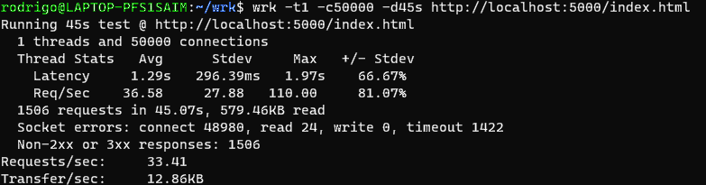

# SRE-chanllenge

#Prueba tecnica Chanllenge, Devops
# El Problema:
Se ha proporcionado un cuaderno jupyter notebook que contiene el trabajo de un Data Scientist y ML Engineer.

– El problema que trató de resolver el DS fue predecir la probabilidad de atraso de los vuelos que aterrizan o
despegan del aeropuerto de Santiago de Chile (SCL). Para eso utilizó un dataset de datos públicos y reales
donde cada fila corresponde a un vuelo que aterrizó o despegó de SCL.
– Para cada vuelo se cuenta con la siguiente información:

Como SRE Engineer, tu desafío consiste en tomar el trabajo del equipo, exponerlo para que sea explotado por un
sistema:

1. Exponer el modelo serializado a través API REST.

Para el primer paso se utilizo el framework de Flask que nos permite crear una api rest para la utilizacion cliente-servidor como se muestra en la sigeunte imagen, con peticiones post y get, con la intencion de ser consumidos, utilizamos un index para exponer el modelo mas optimo para este problema,
fue almacenado y cargado de forma serializada con pickle en respectiva api, ya que luego se utilizara para predecir si el avion .

  

2. Automatizar el proceso de construcción y despliegue de la API, utilizando uno o varios servicios cloud.

Para la construcción de nuestra API y Jupyter Notebook, fue realizada por medio el software Docker por su enorme simplicidad,
se automatizaron procesos de guardado de nuestro notebook y algunos archivos en github en nuestro respositorio en la rama develop.
Luego que ya lo implementamos de forma local se desarolla a través de Terraform con el fin de obtener nuestro repositorio aun más automatizado.

3. Hacer pruebas de estrés a la API con el modelo expuesto con al menos 50.000 requests durante 45
segundos.

Se utilizo wrk para el estrés de la API, realizamos 3 pruebas distintas a la ruta localhost:5000 con parametros de thread de 1, 3 y 6, como se representaran a continuación en las siguientes imágenes. 

Prueba de estres a la API nº1

  

Prueba de estres a la API nº2

  

Prueba de estres a la API nº3

  

Ya que solo nos permitió con estos parametros de thread mostrado en las pruebas anteriormente, se deduce que los resultados son simelares, pero la prueba que contiene 3 thread se logra obtener menos segundos en AVG de latencia además notamos que la primera imagen que contiene 1 thread, los resultados de desviacion estándar de latencia son menores a comparacion de las otras dos pruebas de estres.

a. ¿Cómo podrías mejorar el performance de las pruebas anteriores?

Las pruebas podrían mejorar en un automatizando de este procesó, generando un guardado de estos resultados obtenidos por la estres realizada a la API, o implementarlo desde un pipeline con ci y cd.

 5. ¿Cuáles serían los mecanismos ideales para que sólo sistemas autorizados puedan acceder a esta API?

Seria mediante LDAP, en las dos ultimas oportunidades de trabajo ocupan este sistema y verifica solo con las personas de la empresa de forma segura.

a. ¿Este mecanismo agrega algún nivel de latencia al consumidor? ¿Por qué?

A mi prejuicio si, pero en primera ocacion se debería implemenmtar LDAP y obtener metricas que validen si se agrega algun nivel de latencia, luego analizar y discutir los datos.

6. ¿Cuáles serían los SLIs y SLOs que definirías y por qué?
SLOs las definiria en primera instancia seria mapear nuestros objetivos alcansables, luego controlar nuestra SLO priorisando las tareas de acuerdo a efectuar las necesidades del cliente. En las SLI evalúa el cumplimiento de un SLO, por ejemplo para ver cuanto tiempo estaran disponibles nuestros sistemas, cumpliendo o superando las promesas realizada en els documento. 

## Instructivo despliegue de ambiente.

1. `git clone https://github.com/Rodrigomontenegrofarias/SRE-chanllenge.git`
2. `cd SRE-chanllenge`
3. `cd terraform`
4. `install terraform`
5. `ejecutar terraform init`
6. `ejecutar terraform validate`
7. `ejecutar terraform apply`

# Nuestro ambientes estaran alojados en los siguientes Link:

1. [API](https://localhost:5000)

2. [Notebook Jupyter](https://localhost:8881)

Se ejecuta la pagina web de jupyter nobtebook  con el fin de guardar el mejor modelo automatico de pickle de forma serializada. Luego se puede probar el modelo de deacuerdo las variables que son 36, estimando con el modelo en localhost:5000, como se visualiza en el siguente video.

https://user-images.githubusercontent.com/59695256/200410471-d3cdb85f-834b-4110-94e4-d5a413e8e695.mp4

Por ultimo se efecutaron pruebas predictivas, en el caso que avion obtenga una probabilidad de atraso o no, de acuerdo a las variables de entrada que fueron mencionadas anteriormente y vistas en el video, logrando predecir o estimar correctamente.

